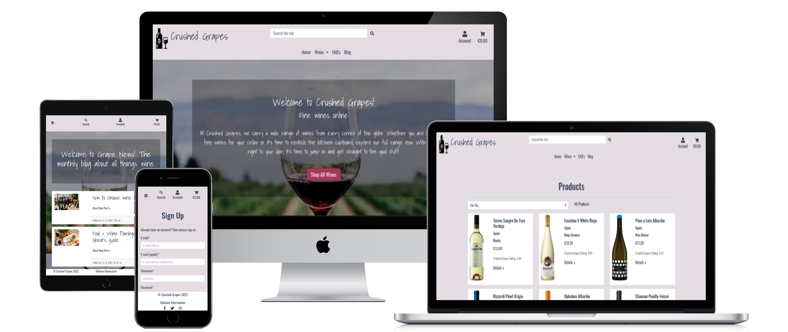

# Crushed Grapes

View the live website [here](https://crushed-grapes.herokuapp.com/).
---
Crushed Grapes is an online wine store created for educational purposes only for the Code Institute Final Milestone Project. Users can browse through the selection of wines available, sort results and search the site for a particular item, select products to purchase, add them to their cart and finally use a secure checkout facilty to make their purchase, and receive email confirmation of their order. Registered users can further choose to add reviews to any products. Store Admin can add, edit and delete products from the database, and also add, edit or remove blog posts to/from the site. 

___ 
## Contents
* [UX](#UX)
* [Database](#database)
* [Features](#features)
* [Technologies Used](#technologies-used)
* [Testing](#testing)
* [Deployment](#deployment)
* [Credits](#credits)
___

## UX
### Project Goals

This site has been created to provide users with a fully functioning e-commerce website for those interested in shopping for, and purchasing, wine online.
While this site has been created for eductional purposes only, the aim has been to provide an intuitive, user friendly, easy to navigate website that is clear and easy to understand for each step of the browsing and purchasing process and providing feeback to users along the way, each time an action is performed. 

### User Stories
##### As a user I want to:
1. view what products are available on this website
2. see all the wine products available
3. see all the details on any particular product and read more info about the product
4. look at different categories of wine rather than having them all display, ie. browse all the red wines only
5. have the option to sort the products in a number of different ways - by price, rating, country and by name
6. search the site for a specific wine
7. easily identify any special offers
8. find out the delivery information ie. where the store delivers to and what the charges are
9. easily add any product to a shopping cart and have the cart hold these items while I continue to shop
10. view the contents of my shopping cart easily at any stage and see how much the running total is so I can keep track of how much I'm spending
11. easily checkout and complete my purchase by paying online securely
12. get an email confirmation of my order sent to me
13. read some interesting articles about wine and perhaps learn things I was not aware of
##### As a registered user I want to:
1. easily register for an account
2. receive an email confirmation when I register my account
3. have the site save my delivery info so I don't have to re-enter that each time I order
4. see my profile and be able to update my delivery details at any time
5. easily log in and see what I have purchased previously
6. easily log out
7. be able to reset my password if I forget it
##### As site owner/admin I want to:
1. easily add new products, make updates to existing products in the database and delete any product
2. encourage users to visit the site even if not planning a purchase
3. have all users confirm they are of legal age to drink alcohol (over 18) before making an order

### Wireframes
View the wireframes [here](docs/ms4-wireframes.pdf)

### Design
#### Overall Design

#### Images
#### Color Scheme
#### Typography
#### Note about Wireframes

## Database

## Features
### Existing Features
### Features to implement in the future

## Technologies Used
#### Languages

* [HTML](https://en.wikipedia.org/wiki/HTML)
* [CSS](https://en.wikipedia.org/wiki/CSS)
* [JavaScript](https://en.wikipedia.org/wiki/JavaScript)
* [Python3](https://en.wikipedia.org/wiki/Python_(programming_language))

#### Programs, Frameworks, Libraries, Resources

* [Django](https://www.djangoproject.com/) High Level Python Framework
* [GitHub](https://github.com/) Code hosting platform
* [Gitpod](https://www.gitpod.io/) IDE used for writing and editing code, version control
* [Heroku](https://en.wikipedia.org/wiki/Heroku) Cloud platform
* [jQuery](https://jquery.com/) JavaScript Library
* [Bootstrap](https://getbootstrap.com/) Front end framework
* [SQLite3](https://www.sqlite.org/index.html) SQL database engine used for Development database
* [PostgreSQL](https://www.postgresql.org/) Relational Database system used for Deployed database
* [Stripe](https://stripe.com/ie) Online payment processing infrastructure
* [AWS](https://aws.amazon.com/) S3 - Storage service for hosting static files and images
* [Google Fonts](https://fonts.google.com/) Font library
* [Font awesome](https://fontawesome.com/) Icons
* [Pixlr](https://pixlr.com/e/) Image Editor used for main background image optimisation
* [TinyPNG](https://tinypng.com/) Image compressor
* [Balsamiq](https://balsamiq.com/wireframes/) Wireframe software
* [dbdiagram.io](https://dbdiagram.io/home) Database diagram design software
* [coolers.co](https://coolors.co/) Color scheme generator
* [Randomkeygen.com](https://randomkeygen.com/) Secure password/secret key generator
* [Favicon.io](https://favicon.io/favicon-converter/) Favicon generator
* [Website Mockup Generator](https://websitemockupgenerator.com/) used to generate responsive screenshot
* [Autoprefixer.io](https://autoprefixer.github.io/) used to add vendor prefixes for the major browsers

[Back to Contents](#contents)
___
## Testing
Testing is detailed in a seperate document [here](TESTING.md).

[Back to Contents](#contents)
___
## Deployment

## Credits
### Content

All product images and detail content for the products database has been taken from external sources. I used 2 primary sources - 
1. [O'Brien's wine](https://www.obrienswine.ie/) website. Some images and almost all content on individual wines is from here. 
2. The second primary source was used mostly for images with some content also - [Vivino.com](https://www.vivino.com/IE/en/)

I also used a small number of images & product detail from [SuperValu.ie](https://shop.supervalu.ie/shopping/specialoffers/wine-beer-spirits/150200590) & [Tesco.ie](https://www.tesco.ie/groceries/product/browse/default.aspx?N=4294953032&Ne=4294954028)

Blog Post on Food Pairing - content taken from [The Wine Cellar Group](https://www.thewinecellargroup.com/wine-pairing-tips-for-beginners/)

Blog Post on how to choose wine - content taken from [GQ](https://www.gq.com/story/how-to-choose-wine-like-a-pro-in-any-situation)

### Code
### Media
#### Images

Product images as credited above.

Image of wine & cheese on Food Pairing blog: Photo by <a href="https://unsplash.com/@sugercoatit?utm_source=unsplash&utm_medium=referral&utm_content=creditCopyText">Melissa Walker Horn</a> on <a href="https://unsplash.com/@msull21/likes?utm_source=unsplash&utm_medium=referral&utm_content=creditCopyText">Unsplash</a>

Image on how to choose wine blog post: Photo by <a href="https://unsplash.com/@chuttersnap?utm_source=unsplash&utm_medium=referral&utm_content=creditCopyText">CHUTTERSNAP</a> on <a href="https://unsplash.com/s/photos/bottles-of-wine?utm_source=unsplash&utm_medium=referral&utm_content=creditCopyText">Unsplash</a>

Default image for blog posts if none uploaded: Photo by <a href="https://unsplash.com/@apolophotographer?utm_source=unsplash&utm_medium=referral&utm_content=creditCopyText">Apolo Photographer</a> on <a href="https://unsplash.com/@msull21/likes?utm_source=unsplash&utm_medium=referral&utm_content=creditCopyText">Unsplash</a>
  

### Acknowledgements

* The Code Institute Slack community has been the most valuable resource for any questions, problems and general support and I would like to thank the community of fellow students and alumni across the Slack channels for all the information that helped me throughout this and previous projects. 

* Stack Oveflow is another most valuable source of helpful guidance and problem solving.

* My mentor, Nishant Kumar, has been so supportive every step of the way and encouraged me to challenge myself a little bit more with each project.

* Tutor Support on Code Institute has also been a great resource throughout. 

[Back to Contents](#contents)