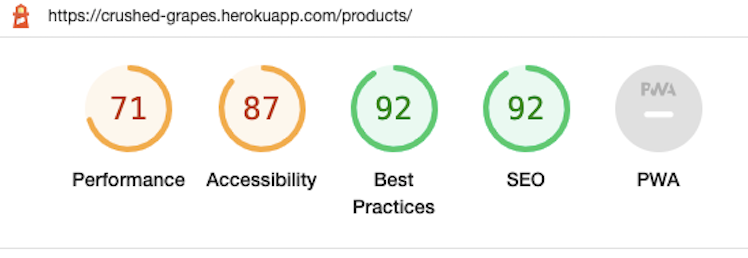

# Crushed Grapes - Testing Details

[Back to README.md file](README.md)

[Live website](https://crushed-grapes.herokuapp.com/)

___
## Contents
* [Code Validation](#code-validation)
* [Automated Testing](#automated-testing)
    + [Lighthouse Testing](#lighthouse-testing)
* [Manual Testing](#manual-testing)
    + [Functionality Testing](#functionality-testing)
    + [Responsiveness](#responsiveness)
    + [Cross Browser](#cross-browser)
* [User Stories Testing](#user-stories-testing)
* [Bugs and Fixes](#bugs-and-fixes)
___

## Code Validation

1. **HTML validated on [W3C Markup Validation Service](https://validator.w3.org/)**
Checked using the 'Validate By URI'.
* Blog app, Cart app, Home app, Products app, Profiles app, Reviews app pages and base.html were checked - only errors due to use of django template logic 
* Checkout app pages - warning 'p' element not allowed as child of 'small' - fixed this warning

2. **CSS validated on [W3C CSS Validation Service](https://jigsaw.w3.org/css-validator/#validate_by_input)**
Checked using the 'Validate by Direct Input' method.
* Blog.css, checkout.css, profile.css, base.css - all passed with no errors

3. **JavaScript validated on [JSHint](https://jshint.com/)**
* All js files and snippets of code within html files were tested using JSHint. Minor errors (missing semicolons) showed up on a couple of files. No other errors were found.

4. **Python valdiated on [PEP8 online](http://pep8online.com/)**
* Adjustments made where possible after running code through pep8 online & also using the `python3 -m flake 8` command in the terminal - most errors were line too long or trailing whitespaces. Some such errors were evident in base code set by Django so I did not change this. 

[Back to Contents](#contents)
***

## Automated Testing
___
### Lighthouse Testing

After initial Lighthouse Testing, I impleneted some fixes as recommended by Lighthouse to improve certain scores particularly on Accessability, adding aria-label or titles to some button or links and a parent ul that was absent on mobile nav.html. Below are the results from a wide selection of pages across the site. There are some notable results that I am not happy with but within the time contraints of the project, I will have to come back to make further fixes at a later date, particularly to improve the performance on the Mobile views of some pages especially the products page. 

* Home page desktop

* Home page mobile

* Blog page desktop

* Blog page mobile

* Shopping cart page desktop

* Shopping cart page mobile

* FAQ's page desktop

* FAQ's page mobile

* Products page desktop

* Products page mobile

* Profile page desktop

* Profile page mobile

* Signup page desktop

* Signup page mobile

[Back to Contents](#contents)
***
## Manual Testing
___
### Functionality Testing

I used Google Chrome Dev Tools at all stages of the project to continuously check how each feature was working and particularly looking at the responsiveness of each section and feature as I worked on them. 

The following are the steps taken to manually test each feature of the website as a non-logged in user - 

All pages:

* Nav Bar
    + clicked on all links to ensure all worked as expected - account icon provides appropriate dropdown options, shopping cart icon brings user to their cart page, logo brings user back to home page, search box functions as expected and returns results when a search term is entered, if any results are found, or 0 products found if no results.
    + links in main nav bar - home page, wines dropdown menu, FAQ's and Blog all direct the user as expected. 

* Footer
    + clicked on all links in footer sections - delivery information brings user to the FAQ's page, the social media icons all open links in a new page (to the main homepage of each platform since this is a fictional site created for project purposes only). 

Home page:

* In addition to the above, the "shop all wines" link was tested and works as expected, bringing the user to the all products page. 

Products Page:

* Nav bar and footer tested as above
* Products display as expected. On scrolling down, clicking on the back to top arrow brings user to the top of the page as expected.
* Sort By box correctly sorts the products as expected depending on the options chosen.
* Selecting from the dropdown menu in the Nav bar correclty displays the chosen category and from there the sort by function works as anticpated by only sorting under the currently chosen category - ie. if red wines has been selected from dropdown, the sort by country, price, rating etc. will only return all red wine results with the appropriate filter. 

Product Details Page: 

* Detailed description etc of wine selected from the products page works as expected. 
* Links to "Add to Cart" and "Continue Shopping" work as expected. 
* Quantity button works as expected and allows user to increase quantity of chosen product easily and clearly. It does not allow user to go above the quantity of 99 set by admin or less than 1. Tested by manually entering a number in the box, form validation works. 
* Add a review - this link brings user to the signin page if they are not currently logged in and will not allow user to add without signing in.

FAQ's page:

* Nav bar and footer links tested as above
* Page works as expected

Blog Page: 

* Nav bar and footer tested as above
* Displays as expected - links to read the blog posts work. One image on test blog did not function when clicking through to read the blog page but this was rectified after testing. 

Shopping Cart Page:

* Nav bar and footer tested as above
* Correct display returned to user if no items in shopping cart
* Items in cart displaying correctly and quantity buttons function as expected here allowing users to increase or decrease quantity in conjunction with the update and remove links. 
* Continue shopping link functions correctly
* Secure checkout link funtions correclty and brings user to checkout page

Checkout & Checkout success Pages: 

* Nav bar and footer tested as above
* Items in the order display correctly along with form to fill in personal details, delivery information and payment information, along with save info box being checked as default. 
* Form validation works to ensure form is filled out with valid information.
* Using Stripe test card number, payment is processed showing a 'payment processing' overlay while awaiting validation from Stripe. The user is redirected to a payment success page (upon a successful payment), showing an order confirmation, a toast message confirming order successfully processed with info that a confirmation email will be sent to the address the user entered.
* The order confirmation page shows the details of product orders and quantity, along with delivery addess and billing summary, order date and order number and a Back to Shopping link whihc brings the user back to the main products page. 

The following are the steps taken in addition to the above in order to manually test each feature of the website as a logged in user - 

Product Details Page:
* Add a review - this brings logged in user to a simple form page for adding a review to the chosen wine. This functions as expected.

My Account Page: 

* The logged in user upon cliking on the my account link is brought to their profile page showing their saved default delivery info (if they have chosen to save it), along with their order history with each order detailed seperately. Clicking on the order number will bring the user to the confirmation page, same as the checkout success page with the toast alert telling the user that the order had been previously confirmed and confirmation email sent on the order date. 
* If the user has uploaded any reviews of any wines, these will display on this page also, with links to edit or delete the reviews if user wishes to do so. 

Clicking on the account menu 'Logout option will bring the user to a sign out page prompting user to confirm sign out. 

Toast messsages - checked at each testing point and messages always display as expected to inform user of their actions with a success or alert message as appropriate. 
Mini snapshot of shopping cart displays correctly when an item is added or removed from cart. 

Superuser features: 

* When logged in as superuser, edit and delete links are displayed on each product card allowing the admin to quickly edit or delete a product, these are also displayed on the product detail page for each product. 
* The admin can also add, edit or delete any reviews customers have uploaded and edit or delete a blog post.
* The admin has the option under the account dropdown to "Manage Products" which allows the admin to enter new products and "Manage Blog" which allows the admin to add a new blog post.

[Back to Contents](#contents)
___

#### Responsiveness

* Checked the responsiveness of the website at every stage of development throughout the project using Chrome Dev tools and once project was deployed tested it on ipad and iphone devices of varying sizes. 

#### Cross Browser

The website was primarily developed and tested using the Google Chrome browser. I then checked the following browsers to ensure all worked as expected - 
+ Firefox
+ Opera
+ Safari
+ Microsoft Edge

No issues were found. 

[Back to Contents](#contents)
___
### User Stories Testing

##### As a user I want to: 
1. _view what products are available on this website_
    + From the home/landing page - click on the "Shop all Wines" button, or from the nav bar, choose the wines dropdown menu
2. _see all the wine products available_
    + From the nav bar, choose the wines dropdown menu and select "All Wines"
3. _see all the details on any particular product and read more info about the product_
    + On the products page, click the details link on any wine and this will open the full details of the product in it's own page
4. _look at different categories of wine rather than having them all display, ie. browse all the red wines only_
    + From the nav bar, choose the wines dropdown menu and select which category of wine eg. "Red Wines"
5. _have the option to sort the products in a number of different ways - by price, rating, country and by name_
    + From the products main page, click on the "Sort By" box to see the various options by which to sort the products including by price, rating, country and category a-z
6. _search the site for a specific wine_
    + This is provided with the search box at the top of the nav bar, users enter a search term and results will display
7. _easily identify any special offers_
    + This is not currently a feature of the website but will be included once MVP is up and runnning
8. _find out the delivery information ie. where the store delivers to and what the charges are_
    + Click on the delivery info link in the footer or FAQ's section in main nav bar
9. _easily add any product to a shopping cart and have the cart hold these items while I continue to shop_
    + from the product details page, click the "Add to Cart" button to add a product and quantity to the shopping cart. This is stored while user is in session
10. _view the contents of my shopping cart easily at any stage and see how much the running total is so I can keep track of how much I'm spending_
    + The shopping cart icon on top right of Nav bar displays the current total in price of all the products in the cart. Clicking on this icon will being the user to the shopping cart page where they can review the details of their cart.
11. _easily checkout and complete my purchase by paying online securely_
    + From the shopping cart page, the user can clik on the "Secure Checkout" button which brings the user to the checkout page where user can review their order and enter their personal and delivery details along with payment details which are handled securely by Stripe
12. _get an email confirmation of my order sent to me_
    + Once payment is processed, an order confirmation is sent by email to the email address provided by the user during the checkout process. 
13. _read some interesting articles about wine and perhaps learn things I was not aware of_
    + Users can click on Blog from any page Nav Bar. The blog page contains articles the site owner feels might be of interest to it's users. 
##### As a registered user I want to:
1. _easily register for an account_
    + From the account dropdown menu in the Nav Bar, the user can select 'Create Account' to register their details on the site.
2. _receive an email confirmation when I register my account_
    + In order to register an account, users will need to veirfy their details - an email will be sent to the address the user provided with a link to verify.
3. _have the site save my delivery info so I don't have to re-enter that each time I order_
    + The "Save Info" box on the checkout page is automatically selected so that users can save their delivery info for next time. This can be unchecked for those that do not wish their details to be saved.
4. _see my profile and be able to update my delivery details at any time_
    + Registered and logged in users can select "My Account" from the Account dropdown menu which will bring the user to their profile page. This page displays the info saved by the site
5. _easily log in and see what I have purchased previously_
    + Registered and logged in users can select "My Account" from the Account dropdown menu which will bring the user to their profile page. This page displays a summary of the previous orders made by the user. The user can click on the order number to see the full details of the order.
6. _easily log out_
    + When logged in, clicking on the "My Account" menu will bring up the option to log out. When selected, the user is redirected to a sign out page to confirm the user wishes to log out. 
7. _be able to reset my password if I forget it_
    + On the sign in page, there is a link to select if the user has forgotten their password. They will then be emailed a link to reset their password. 

##### As site owner/admin I want to:
1. _easily add new products, make updates to existing products in the database and delete any product_
    + Once signed in as a admin/superuser, the "Account" dropdown menu brings up the options to "Manage Products" and "Manage Blog" which will bring up a form for the admin to upload new products or a blog post. There are also links on the products main page, and on the product detail page to make it easy for the admin to edit or delete any product. Similar functionality is contained in the blog post page. 
    + As an extra security feature to help prevent accidental deletions, when the delete option is clicked on, a modal will pop up to ask the user to confirm they wish to delete the product, review or blog post. If the cancel button is selected, the product will not be deleted. 

2. _encourage users to visit the site even if not planning a purchase_
    + The blog post is a feature that can be expanded to have new articles posted more frequently to ensure users have a reason to visit the site even if not making a purchase. The ability for users to add reviews also adds to this. In the future, this can be expanded by features such as 'Wine of the month' or articles about the growers and vineyards featured.

3. _have all users confirm they are of legal age to drink alcohol (over 18) before making an order_
    + Due to the time pressures of project deadlines, this has not been included but is on the list of features to add in the future and would be important on a real world wine e-commerce site. 

[Back to Contents](#contents)
___
### Bugs and Fixes

* When setting up the project at the stage of adding allauth functionality, I could not login to the admin, getting a forbidden 403 error with 'CSRF verification failing'. I found the solution on Slack (Code Institute channels) pointing to an extra setting required in django 4.0 "CSRF TRUSTED ORIGINS". I added this to settings.py and was then able to login to admin. This occured a number times over the course of development as gitpod would on occasion change the local host site address so I updated this each time. 

* Repeatedly a 'Test Error 401' would come up when trying to setup webhooks with Stripe. Again, I found the solution to this in the Code Institute Slack community to ensure the 8000 port was public rather than private. This worked for me. 

* Frequently encountered errors of "No reverse match" and "Integrity Error - not null constrained". Found solutions to both these issues across a combination of Slack and Stack Overflow. 

[Back to Contents](#contents)
___
